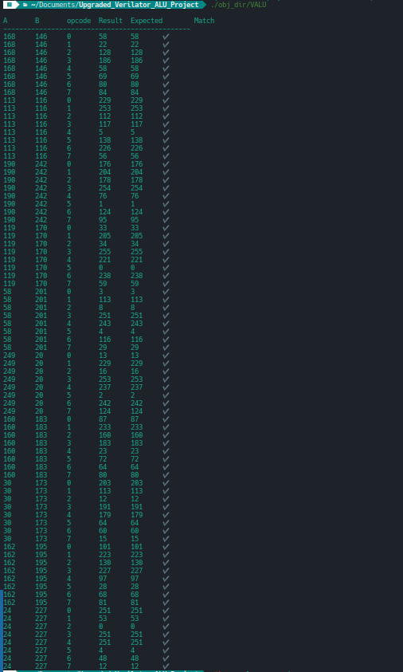
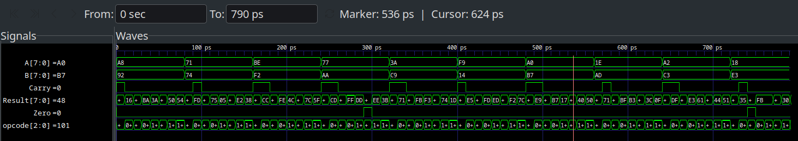

# 8-bit ALU Simulation (Verilog + Verilator + C++)

## Overview
This project is an 8-bit Arithmetic Logic Unit (ALU) written in **Verilog** and tested using a **C++ testbench** with **Verilator**.  
It performs basic arithmetic and logic operations on two 8-bit inputs, with flags for carry and zero.  

I later added two main upgrades:
- **Randomised testing** to automatically check if the ALU output matches a software-calculated result.  
- **Waveform tracing** to view how signals change over time in **GTKWave**.

This helped me understand how digital circuits are verified and tested in real engineering environments.

---

## Features
- 8-bit arithmetic and logic operations  
- Carry and zero flag outputs  
- Random input generation for automated testing  
- Waveform tracing with GTKWave  
- Combinational design (no clock needed)

---

## Example Output
The table below shows randomised results from the Verilator simulation.  
A ✔️ means the ALU output matched the expected value.



## Waveform Visualisation

To better understand how the ALU behaves, I generated a waveform file (`alu_wave.vcd`) after running the simulation.  
This file can be opened in **GTKWave** to show how the input and output signals change over time.



### What the Waveform Shows
- Each line represents one of the ALU’s signals: `A`, `B`, `opcode`, `Result`, `Carry`, and `Zero`.  
- Horizontal segments show when a signal value stays the same.  
- Vertical changes indicate when a signal updates — for example, when a new operation starts.  
- You can see the `opcode` cycling through operations, with the `Result` responding accordingly.  

### How to View It
```bash
gtkwave alu_wave.vcd


